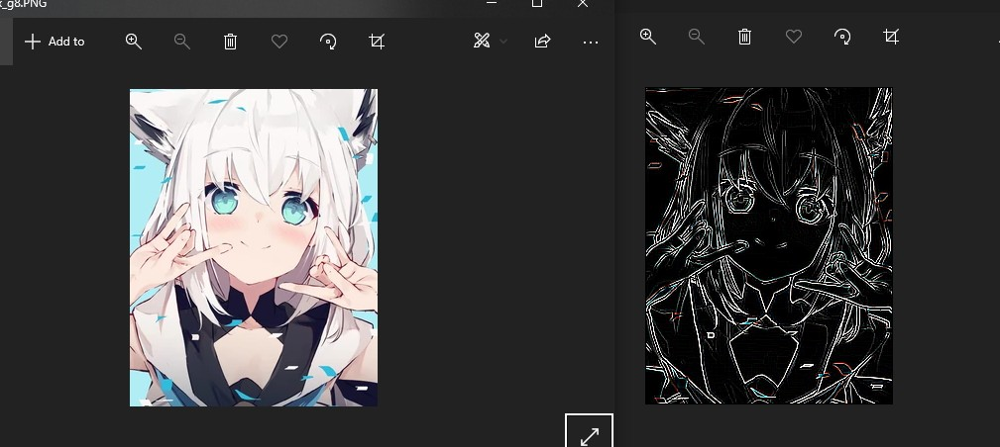

# Simple Image Convolution
**TBA**

Program will calculate image convolution from/to simple image format `.sis`.

`.sis` header only contain 8-bytes unsigned int width and height (header size = flat 16 bytes).

Content contain pixel data with 8-bit color depth, every 3 bytes form a single pixel.

Content are guaranteed to have `width*height*3` bytes, no compression or any encoding for simplicity sake.

Python utils tested on Python3 + Windows 10, program tested on gcc + Ubuntu WSL2

Python package = struct, Pillow

Source image tested = anything below 500x500, .png or .jpg

Source image and ridge detection kernel (src [\@lemon_mito](https://twitter.com/lemon_mito/status/1312780699619917824))

